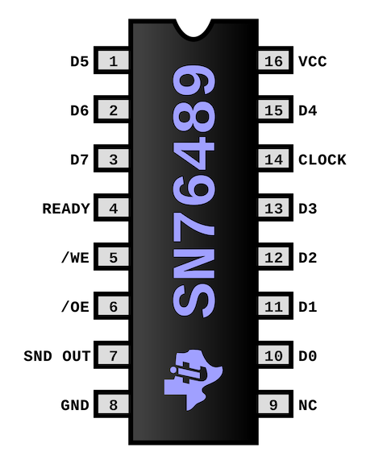

  

# SN76489 PSG in Verilog for Tiny Tapeout 5 (WIP)

    

# Modern replica of a classic SN76489

This Verilog implementation is a replica of the classical **[SN76489](https://en.wikipedia.org/wiki/Texas_Instruments_SN76489)** programmable sound generator.
With roughly a 1400 logic gates replica of the SN76489 fits on a **single tile** of the [TinyTapeout](www.tinytapeout.com).

The main goals of this project are:

1. closely replicate the behavior and eventually the complete **design of the original** SN76489
2. provide a readable and well documented code for educational and hardware **preservation** purposes
3. leverage the **modern fabrication** process

A significant effort was put into a thorough [Cocotb](https://www.cocotb.org) powered **test suite** [test.py](./src/test.py) for regression testing and validation against the original chip behavior.

### Listen to 8-bit music recorded from this chip simulation

## Module parametrization

The module is parameterized and can match variants from the SN76489 family. The following parametrization options are provided:

- noise tapped bits
- tone counter and noise LFSR shift register size
- variable clock divider

## The future work

The next step is to incorporate analog elements into the design to match the original SN76489 - DAC for each channel and an analog OpAmp for channel summmation.

# Chip technical capabilities

- **3 square wave** tone generators
- **1 noise** generator
- 2 types of noise: *white* and *periodic*
- Capable to produce a range of waves typically from **122 Hz** to **125 kHz**, defined by **10-bit** registers.
- **16** different volume levels

* https://en.wikipedia.org/wiki/Texas_Instruments_SN76489
* https://www.vgmpf.com/Wiki/images/7/78/SN76489AN_-_Manual.pdf
* https://www.vgmpf.com/Wiki/index.php?title=SN76489 (Video Game Music Preservation Foundation)
* https://www.smspower.org/Development/SN76489
* http://www.acornatom.nl/sites/atomreview/howel/parts/76489.htm

# Historical use of the SN76489

The SN76489 family of programmable sound generators was introduced by Texas Instruments in 1980. Variants of the SN76489 were used in a number of home computers, game consoles and arcade boards:

- home computers: [TI-99/4](https://en.wikipedia.org/wiki/TI-99/4A), [BBC Micro](https://en.wikipedia.org/wiki/BBC_Micro), [IBM PCjr](https://en.wikipedia.org/wiki/IBM_PCjr), [Sega SC-3000](https://en.wikipedia.org/wiki/SG-1000#SC-3000), [Tandy 1000](https://en.wikipedia.org/wiki/Tandy_1000)
- game consoles: [ColecoVision](https://en.wikipedia.org/wiki/ColecoVision), [Sega SG-1000](https://en.wikipedia.org/wiki/SG-1000), [Sega Master System](https://en.wikipedia.org/wiki/Master_System), [Game Gear](https://en.wikipedia.org/wiki/Game_Gear), [Neo Geo Pocket](https://en.wikipedia.org/wiki/Neo_Geo_Pocket) and [Sega Genesis](https://en.wikipedia.org/wiki/Sega_Genesis)
- arcade machines by Sega & Konami and would usually include 2 or 4 SN76489 chips

## Compatible chips
* SN76489AN
* SN76496
* SN76494
* SN94624
* TMS9919

The SN76489 chip family competed with the similar [General Instrument AY-3-8910](https://en.wikipedia.org/wiki/General_Instrument_AY-3-8910).

Osciloscope recordings
* https://scarybeastsecurity.blogspot.com/2020/06/sampled-sound-1980s-style-from-sn76489.html

Reverse Engineering and chip decap images
* https://siliconpr0n.org/map/ti/sn76489an/
* https://github.com/gchiasso/76489A-analysis partially analysed chip die
* https://github.com/emu-russia/SEGAChips/tree/main/VDP/PSG partially reverse engineered schematics based on SN76489 included in Sega Mega Drive VDP chip

Implementations
* https://github.com/OpenVGS/OPSG
* https://github.com/jotego/jt89
* https://github.com/dnotq/sn76489_audio
* https://github.com/mamedev/mame/blob/master/src/devices/sound/sn76496.cpp
* https://github.com/digital-sound-antiques/emu76489
* https://github.com/nukeykt/Nuked-PSG based on YM7101 decap
* https://www.eevblog.com/forum/projects/sound-synthesiser-for-retro-computing/ using discreet 74HC IC logic

Music playback!
* https://github.com/simondotm/vgm-converter convert from VGM file format to 50Hz resampled raw stream of data
* Notable tune & SMS Power 2005 compo winner: [MISSION76496 by hally](https://www.smspower.org/Music/MISSION76496-Homebrew)
* https://www.stairwaytohell.com/music/index.html?page=vgmarchive Music from several BBC Micro games
* https://vgmrips.net/packs/system/tandy-corporation/tandy-1000 Music from several Tandy 100 games
* https://vgmrips.net/packs/system/sega/sg-1000 Sound effects from several Sega SG1000 games

## What is Tiny Tapeout?

TinyTapeout is an educational project that aims to make it easier and cheaper than ever to get your digital designs manufactured on a real chip.

To learn more and get started, visit https://tinytapeout.com.

### Verilog Projects

Edit the [info.yaml](info.yaml) and uncomment the `source_files` and `top_module` properties, and change the value of `language` to "Verilog". Add your Verilog files to the `src` folder, and list them in the `source_files` property.

The GitHub action will automatically build the ASIC files using [OpenLane](https://www.zerotoasiccourse.com/terminology/openlane/).

### How to enable the GitHub actions to build the ASIC files

Please see the instructions for:

- [Enabling GitHub Actions](https://tinytapeout.com/faq/#when-i-commit-my-change-the-gds-action-isnt-running)
- [Enabling GitHub Pages](https://tinytapeout.com/faq/#my-github-action-is-failing-on-the-pages-part)

### Resources

- [FAQ](https://tinytapeout.com/faq/)
- [Digital design lessons](https://tinytapeout.com/digital_design/)
- [Learn how semiconductors work](https://tinytapeout.com/siliwiz/)
- [Join the community](https://discord.gg/rPK2nSjxy8)

### What next?

- Submit your design to the next shuttle [on the website](https://tinytapeout.com/#submit-your-design). The closing date is **November 4th**.
- Edit this [README](README.md) and explain your design, how it works, and how to test it.
- Share your GDS on your social network of choice, tagging it #tinytapeout and linking Matt's profile:
  - LinkedIn [#tinytapeout](https://www.linkedin.com/search/results/content/?keywords=%23tinytapeout) [matt-venn](https://www.linkedin.com/in/matt-venn/)
  - Mastodon [#tinytapeout](https://chaos.social/tags/tinytapeout) [@matthewvenn](https://chaos.social/@matthewvenn)
  - Twitter [#tinytapeout](https://twitter.com/hashtag/tinytapeout?src=hashtag_click) [@matthewvenn](https://twitter.com/matthewvenn)

