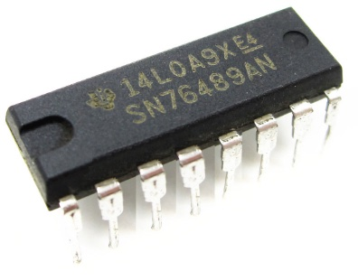

  

# SN76489 PSG in Verilog for Tiny Tapeout 5 (WIP)

    

Info
* https://en.wikipedia.org/wiki/Texas_Instruments_SN76489
* https://www.vgmpf.com/Wiki/images/7/78/SN76489AN_-_Manual.pdf
* https://www.vgmpf.com/Wiki/index.php?title=SN76489 (Video Game Music Preservation Foundation)
* https://www.smspower.org/Development/SN76489
* http://www.acornatom.nl/sites/atomreview/howel/parts/76489.htm

Computers that used SN76489
* BBC Micro, Tandy 100, Sega SG1000

Osciloscope recordings
* https://scarybeastsecurity.blogspot.com/2020/06/sampled-sound-1980s-style-from-sn76489.html

Chip decap images
* https://siliconpr0n.org/map/ti/sn76489an/
* https://github.com/gchiasso/76489A-analysis partially analysed

Implementations
* https://github.com/OpenVGS/OPSG
* https://github.com/jotego/jt89
* https://github.com/dnotq/sn76489_audio
* https://github.com/mamedev/mame/blob/master/src/devices/sound/sn76496.cpp
* https://github.com/digital-sound-antiques/emu76489
* https://github.com/nukeykt/Nuked-PSG based on YM7101 decap

Music playback!
* https://github.com/simondotm/vgm-converter convert from VGM file format to 50Hz resampled raw stream of data
* Notable tune & SMS Power 2005 compo winner: [MISSION76496 by hally](https://www.smspower.org/Music/MISSION76496-Homebrew)
* https://www.stairwaytohell.com/music/index.html?page=vgmarchive Music from several BBC Micro games
* https://vgmrips.net/packs/system/tandy-corporation/tandy-1000 Music from several Tandy 100 games
* https://vgmrips.net/packs/system/sega/sg-1000 Sound effects from several Sega SG1000 games

## What is Tiny Tapeout?

TinyTapeout is an educational project that aims to make it easier and cheaper than ever to get your digital designs manufactured on a real chip.

To learn more and get started, visit https://tinytapeout.com.

### Verilog Projects

Edit the [info.yaml](info.yaml) and uncomment the `source_files` and `top_module` properties, and change the value of `language` to "Verilog". Add your Verilog files to the `src` folder, and list them in the `source_files` property.

The GitHub action will automatically build the ASIC files using [OpenLane](https://www.zerotoasiccourse.com/terminology/openlane/).

### How to enable the GitHub actions to build the ASIC files

Please see the instructions for:

- [Enabling GitHub Actions](https://tinytapeout.com/faq/#when-i-commit-my-change-the-gds-action-isnt-running)
- [Enabling GitHub Pages](https://tinytapeout.com/faq/#my-github-action-is-failing-on-the-pages-part)

### Resources

- [FAQ](https://tinytapeout.com/faq/)
- [Digital design lessons](https://tinytapeout.com/digital_design/)
- [Learn how semiconductors work](https://tinytapeout.com/siliwiz/)
- [Join the community](https://discord.gg/rPK2nSjxy8)

### What next?

- Submit your design to the next shuttle [on the website](https://tinytapeout.com/#submit-your-design). The closing date is **November 4th**.
- Edit this [README](README.md) and explain your design, how it works, and how to test it.
- Share your GDS on your social network of choice, tagging it #tinytapeout and linking Matt's profile:
  - LinkedIn [#tinytapeout](https://www.linkedin.com/search/results/content/?keywords=%23tinytapeout) [matt-venn](https://www.linkedin.com/in/matt-venn/)
  - Mastodon [#tinytapeout](https://chaos.social/tags/tinytapeout) [@matthewvenn](https://chaos.social/@matthewvenn)
  - Twitter [#tinytapeout](https://twitter.com/hashtag/tinytapeout?src=hashtag_click) [@matthewvenn](https://twitter.com/matthewvenn)

