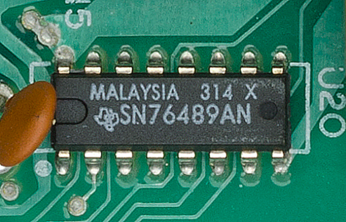
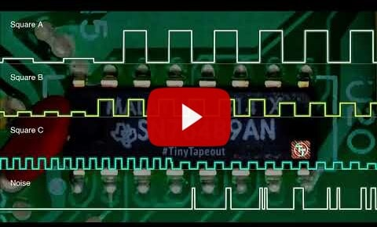
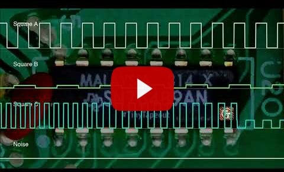

  

# ASIC for SN76489 PSG in Verilog for Tiny Tapeout 5

<p align="center" width="100%">
    
</p>


# Modern replica of a classic SN76489

This Verilog implementation is a replica of the classical **[SN76489](https://en.wikipedia.org/wiki/Texas_Instruments_SN76489)** programmable sound generator.
With roughly a 1400 logic gates this design fits on a **single tile** of the [TinyTapeout](www.tinytapeout.com).

The main goals of this project are:

1. closely replicate the behavior and eventually the complete **design of the original** SN76489
2. provide a readable and well documented code for educational and hardware **preservation** purposes
3. leverage the **modern fabrication** process

A significant effort was put into a thorough [Cocotb](https://www.cocotb.org) powered **test suite** [test.py](./src/test.py) for regression testing and validation against the original chip behavior.

### Module parametrization

The module is parameterized and can match variants from the SN76489 family. The following parametrization options are provided:

- noise tapped bits
- tone counter and noise LFSR shift register size
- variable clock divider

### The future work

The next step is to incorporate analog elements into the design to match the original SN76489 - DAC for each channel and an analog OpAmp for channel summation.

### Listen to music recorded from this chip simulation

<p align="center" width="100%">
    <a href="https://www.youtube.com/watch?v=HXLAdA02I-w">
        
    </a>    
    <a href="https://www.youtube.com/watch?v=ghBGasckpSY">
        
    </a>
</p>

# ASIC

The ASIC for the SN76489 replica is built using the open source Skywater 130nm [PDK](https://github.com/google/skywater-pdk) and is part of multi project [TinyTapeout](www.tinytapeout.com).

Using 130nm process this SN76489 fits in **160x100** um. The design consist of roughly **1400** digital logic gates and of which **173** are data flip-flops storing 1 bit of data each. Logic takes 75% of the chip area. Total wire length is **46 mm**!

<p align="center" width="100%">
    
</p>

Examine the layout of this chip in [3D](https://gds-viewer.tinytapeout.com/?model=https://rejunity.github.io/tt05-psg-sn76489/tinytapeout.gds.gltf)!

# Chip technical capabilities

- **3 square wave** tone generators
- **1 noise** generator
- 2 types of noise: *white* and *periodic*
- Capable to produce a range of waves typically from **122 Hz** to **125 kHz**, defined by **10-bit** registers.
- **16** different volume levels

<p align="center" width="100%">
    
</p>

For a more detailed information on the inner workings of the chip, visit:
* [Technical Manual](./docs/SN76489AN_Manual.pdf)
* [Functional Behavior and Implementation in Emulators](https://www.smspower.org/Development/SN76489)

# Historical use of the SN76489

The SN76489 family of programmable sound generators was introduced by Texas Instruments in 1980. Variants of the SN76489 were used in a number of home computers, game consoles and arcade boards:

- home computers: [TI-99/4](https://en.wikipedia.org/wiki/TI-99/4A), [BBC Micro](https://en.wikipedia.org/wiki/BBC_Micro), [IBM PCjr](https://en.wikipedia.org/wiki/IBM_PCjr), [Sega SC-3000](https://en.wikipedia.org/wiki/SG-1000#SC-3000), [Tandy 1000](https://en.wikipedia.org/wiki/Tandy_1000)
- game consoles: [ColecoVision](https://en.wikipedia.org/wiki/ColecoVision), [Sega SG-1000](https://en.wikipedia.org/wiki/SG-1000), [Sega Master System](https://en.wikipedia.org/wiki/Master_System), [Game Gear](https://en.wikipedia.org/wiki/Game_Gear), [Neo Geo Pocket](https://en.wikipedia.org/wiki/Neo_Geo_Pocket) and [Sega Genesis](https://en.wikipedia.org/wiki/Sega_Genesis)
- arcade machines by Sega & Konami and would usually include 2 or 4 SN76489 chips

The SN76489 had [many very similar variants](https://www.vgmpf.com/Wiki/index.php?title=SN76489), amongst them are SN76496, SN76494, SN94624 and TMS9919.

The SN76489 chip family competed with the similar [General Instrument AY-3-8910](https://en.wikipedia.org/wiki/General_Instrument_AY-3-8910).

# The SN76489 Reverse Engineered

<p align="center" width="100%">
    
</p>

This implementation is based on the results from reverse engineering efforts:

1. [Annotations and analysis](https://github.com/gchiasso/76489A-analysis) of a decapped SN76489A chip.
2. Reverse engineered [schematics](https://github.com/emu-russia/SEGAChips/tree/main/VDP/PSG) based on a decapped VDP chip from Sega Mega Drive which included a SN76496 variant.

#### High resolution decapped images
* https://siliconpr0n.org/map/ti/sn76489an/
* https://github.com/emu-russia/SEGAChips/blob/main/VDP/PSG/Docs/PSG_Other.jpg

#### Oscilloscope recordings
* https://scarybeastsecurity.blogspot.com/2020/06/sampled-sound-1980s-style-from-sn76489.html

# Record music from the Verilog simulated design!

Simulated Verilog design can be fed with the stream of register values captured on a 8-bit computer in [Video Game Music (VGM)](https://vgmrips.net/wiki/VGM_Specification) format and 
output converted to .wav file. This process is recommended for both testing and enjoying 8-bit era music!

First, install the needed libraries
```
    sudo apt install iverilog
    pip3 install cocotb pytest
```

To record VGM file:

```
    make MODULE=record VGM=../music/CrazeeRider-title.bbc50hz.vgm
    cd ../output
```

For a reference you can find music recorded from the chip simulation:

- https://www.youtube.com/watch?v=ghBGasckpSY - Crazee Rider BBC Micro game
- https://www.youtube.com/watch?v=HXLAdA02I-w - MISSION76496 tune for Sega Master System

### Music archives suitable for SN76489 

* [Music from BBC Micro games](https://www.stairwaytohell.com/music/index.html?page=vgmarchive)
* [Music from Sega Master System games](https://www.zophar.net/music/sega-master-system-vgm)
* [Music from Tandy 100 games](https://vgmrips.net/packs/system/tandy-corporation/tandy-1000)
* [Sound effects from Sega SG1000 games](https://vgmrips.net/packs/system/sega/sg-1000)

Note that currently only VGM file version 1.50 or higher are supported. You can convert older VGM files to 1.50 with https://github.com/simondotm/vgm-converter

# How to test this design?

## Prerequisites

Follow the instructions from Tiny Tapeout's [Testing Your Design Guide](https://tinytapeout.com/hdl/testing/) and install required packages, first.

```
    sudo apt install iverilog verilator
    pip3 install cocotb pytest
```

## Test-suite

First of all, run the test suite: `make` from the `\src` folder. `make` will compile the Verilog source and launch `cocotb` test suite.

```
    cd src
    make
```

There are a number of useful functions in [test.py](./src/test.py) that simplify communication with the sound generator.

The following example sets up 440Hz (A4) note at the full volume on the 1st channel and white noise at the half volume:
```
    await reset(dut)
    await set_volume(dut, channel='1', 15)          # Set `Channel 1` to maximum volume
    await set_tone(dut, channel='1', frequency=440) # Play 440 Hz note on `Channel 1`
    await set_volume(dut, channel='4', 8)           # Set `Channel 4` (noise channel) to half volume
    await set_noise(dut, white=True, divider=512):  # Use on the 3 hardcoded divider values for noise generator
    await set_noise_via_tone3(dut, white=True)      # results in approximately 1 kHz white noise when chip is clocked at 4 MHz
```

## Connect chip to the speaker

There are several ways to connect this chip to the microcontroller and speaker.

One option is to connect off the shelf data parallel Digital to Analog Converter (DAC)
for example [Digilent R2R Pmod](https://digilent.com/reference/pmod/pmodr2r/start) to the output pins and
route the resulting analog audio to piezo speaker or amplifier.

Another option is to use the Pulse Width Modulated (PWM) AUDIO OUT pin with OpAmp+capacitor based integrator or capacitor based low-pass filter and a speaker:

```

uController              SN76489
,---------.            ,---._.---. 
|         |    4 Mhz ->|CLK  SEL0|<-- 0
|    GPIOx|----------->|D0   SEL1|<-- 0
|    GPIOx|----------->|D1       |
|    GPIOx|----------->|D2       |
|    GPIOx|----------->|D3       |          C1
|    GPIOx|----------->|D4       |     ,----||----.
|    GPIOx|----------->|D5       |     |          | 
|    GPIOx|----------->|D6       |     |  OpAmp   |        Speaker     
|    GPIOx|----------->|D7  AUDIO|     |   |\     |            /|
|    GPIOx|----------->|/WE  OUT |-----.---|-\    |   C2   .--/ |
`---------'            `---------'         |  }---.---||---|    |
                                        ,--|+/             `--\ |
                                        |  |/               |  \|
                                        |                   |
                                       ---                 ---  
                                       GND                 GND
```

## Summary of commands to communicate with the chip

Once playback schematics of the SN76489 are established, the controller program has to send data to the chip. SN76489 is programmed by updating its internal registers via data bus.

Below is a short summary of the communication protocol of SN76489. Please consult [SN76489 Technical Manual](https://github.com/rejunity/tt05-psg-sn76489/blob/main/docs/SN76489AN_Manual.pdf) for more information.

| Command  | Description                | Parameters                                |
|----------|----------------------------|-------------------------------------------|
| 1cc0ffff | Set tone fine frequency    | f - 4 low bits, c - channel #             |
| 00ffffff | Follow up with coarse freq | f - 6 high bits                           |      
| 11100bff | Set noise and frequency    | b - white/periodic, f - frequency control |
| 1cc1aaaa | Set channel attenuation    | a - 4 bit attenuation, c - channel #      |

| NF1 | NF0 | Noise frequency control       |
|-----|-----|-------------------------------|
| 0   |   0 | Clock divided by 512          |
| 0   |   1 | Clock divided by 1024         |
| 1   |   0 | Clock divided by 2048         |
| 1   |   1 | Use channel #2 tone frequency |

### Note frequency

Use the following formula to calculate the 10-bit value for a particular note frequency:

```
n = clock_frequency / (32 * note_frequency)
```

For example 10-bit value that plays 440 Hz note on a chip clocked at 4 MHz would be:

```
n = 4000000 Hz / (32 * 400 Hz)
n = 284 = h11C
```

### An example sequence of data bus writes.

Hold **/WE** LOW while writing to the data bus.

```
10001100 - Set channel #0 tone 4 low bits to hC
00010001 -    ---//---    tone 6 high bits to hC
10010000 -    ---//---    volume to 100% (attenuation = 0)
11100100 - Set channel #3, noise type to white and frequency to 512 (NF1/NF0 bits = 0)
11111000 -    ---//---    volume to 50% (attenuation = 8)
```

### Timing diagram
```

CLK   ____      ____      ____      ____      ____      ____         
   __/    \____/    \____/    \____/    \____/    \____/    \___ ...
     |        |         |         |         |         |
     |        |         |         |         |         |

/WE_(inverted write enable)     __        __        _______
     \_____/  \______/  \______/  \______/  \______/   *
                                                       ^
D0..D7_______  ________  ________  ________  ________  |
   _/10001100\/00010001\/10010000\/11100100\/11111000\_|______
      chan#0    chan#0    chan#0    chan#3    chan#3   |
    tone=h??C   =h11C    atten=0    div=16    atten=8  |
      h011C = 440 Hz              /16 = ~1 Khz         |
                                 white noise           |
                                                       |
                                                 noise restarts
                                            after /WE goes high and
                                      there was a write to noise register

```

# Differences from the original hardware

This Verilog implementation is a completely digital and synchronous design that differs from the original SN76489 design which incorporated analog parts.

#### Audio signal output

While the original chip had integrated OpAmp to sum generated channels in analog fashion, this implementation does digital signal summation and digital output.
The module provides two alternative outputs for the generated audio signal:

1. digital 8-bit audio output suitable for external Digital to Analog Converter (DAC)
2. pseudo analog output with Pulse Width Modulation (PWM)

#### Separate 4 channel output

Outputs of all 4 channels are exposed along with the master output. This allows us to validate and mix signals externally.
In contrast the original chip was limited to a single audio output pin due to the PDIP-16 package.

#### No DC offset

This implementation produces unsigned output waveforms without DC offset.

#### **/CE** and **READY** pins are omitted for simplicity

**/CE**, chip enable control pin is omitted in this design. The behavior is the same as if **/CE** is tied *low* and the chip is considered always enabled.

Unlike the original SN76489 which took 32 cycles to update registers, this implementation handles register writes in a single cycle and chip behaves as always **READY**.

#### Synchronous reset and single phase clock

The original design employed 2 phases of the clock for the operation of the registers. The original chip had no reset pin and would wake up to a random state.

To make it easier to synthesize and test on FPGAs this implementation uses single clock phase and synchronous reset for registers.

# Externally configurable clock divider

A configurable clock divider was introduced in this implementation. Clock divider can be controlled through **SEL0** and **SEL1** control pins and allows to select between 3 chip variants:

1. the original SN76489 with the master clock internally divided by 16. This classical chip was intended for PAL and NTSC frequencies. However in [BBC Micro](https://en.wikipedia.org/wiki/BBC_Micro) 4 MHz clock was employed.
2. SN94624/SN76494 variants without internal clock divider. These chips were intended for use with 250 to 500 KHz clocks.
3. high frequency clock configuration for TinyTapeout, suitable for a range between 25 MHz and 50 Mhz. In this configuration the master clock is internally divided by 128.

| SEL1 | SEL0 | Description                        | Clock frequency|
|------|------|------------------------------------|----------------|
| 0    |    0 | SN76489 mode, clock divided by 16  | 3.5 .. 4.2 MHz |
| 1    |    1 |           -----//-----             | 3.5 .. 4.2 MHz |
| 0    |    1 | SN76494 mode, no clock divider     | 250 .. 500 kHZ |
| 1    |    0 | New mode for TT05, clock div. 128  |  25 .. 50  MHz |

# Alternative SN76489 implementations
* https://github.com/OpenVGS/OPSG - Verilog
* https://github.com/dnotq/sn76489_audio - Verilog
* https://github.com/jotego/jt89 - VHDL
* https://github.com/mamedev/mame/blob/master/src/devices/sound/sn76496.cpp - C++ MAME
* https://github.com/digital-sound-antiques/emu76489 - C
* https://www.eevblog.com/forum/projects/sound-synthesiser-for-retro-computing - using only discreet 74-series logic ICs!

# What is Tiny Tapeout?

TinyTapeout is an educational project that aims to make it easier and cheaper than ever to get your digital designs manufactured on a real chip.

To learn more and get started, visit https://tinytapeout.com.

### Resources

- [FAQ](https://tinytapeout.com/faq/)
- [Digital design lessons](https://tinytapeout.com/digital_design/)
- [Learn how semiconductors work](https://tinytapeout.com/siliwiz/)
- [Join the community](https://discord.gg/rPK2nSjxy8)

